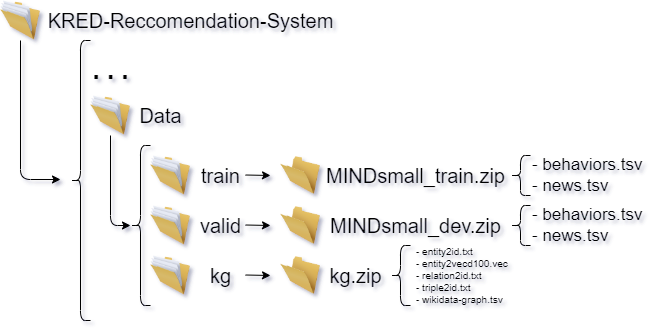

## Introduction

This repository consists of the implementation of [KRED: Knowledge-Aware Document Representation for News Recommendations](https://arxiv.org/abs/1910.11494) using as a starting point the [paper authors' code](https://github.com/danyang-liu/KRED.git) which has been refactored and enhanced.

Content of this document:
- Original model description
- Dataset description
- Guide for reproducing the experiments
- Environment requirements
- Extensions developed by our team

This repository contains:
- This descriptive document
- The actual code implementation
- The python notebook to be run on Google Colab (for a quick execution)

This repository does NOT contain:
- The dataset
- The checkpoints saved during the model training phase  
(due to storage restrictions imposed by GitHub)

## Model description #TODO: review this section


KRED is a knowledge enhanced framework which enhance a document embedding with knowledge information for multiple news recommendation tasks. The framework mainly contains two part: representation enhancement part(left) and multi-task training part(right).

##  Dataset description: #TODO: review this section

We use [MIND dataset](https://msnews.github.io) in this repo (in these experiments we do not use the local news detection task due to MIND dataset missing location information).

##  Reproducing the experiments:
Two main options are available to run this project: it can either be executed locally or, alternatively, on a Python Notebook on Google Colab.

To run the code locally it is necessary to clone this repository, possibly using the preferred IDE, and subsequently add the required data. The dataset directory must be structured as follows in order for the code to run properly:
  
(The dataset can be downloaded from [here](https://msnews.github.io/))

Once fulfilled the aforementioned requirements, the project can be run from an IDE or executing the following command:
```
$ python main.py  (this will run KRED for user2item single task training set by default parameters)
```

Alternatively, it is also possible to open *KRED_notebook.ipynb* inside *Google Colab*, the notebook clones the latest version of this repository and loading the dataset into the proper folder from Google Drive (it is suggested to contact our team to get access to the Drive credentials).
#TODO: upload the finished notebook with the proper name


## Environment requirements:
The code has been tested running under Python 3.6.10, with the following packages installed (along with their dependencies): #TODO: check whether colan uses 3.6/7/8
- numpy==1.19.1
- pytorchtools==0.0.2
- scikit-learn==0.23.2
- scipy==1.5.2
- sentence-transformers==2.2.2
- torch==1.4.0

## Extensions:
Two extensions have been explored and developed for this project:
- domain adaptation --> movies recomendation #TODO: define the details, describe the extension and link the forked github repo (new branch)
- data enrichment --> news articles reading time (adressa dataset) #TODO: define the details, describe the extension and link the forked github repo (new branch)
