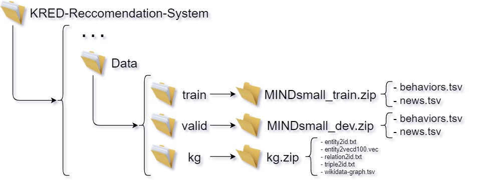

## Introduction

This repository consists of the implementation of [KRED: Knowledge-Aware Document Representation for News Recommendations](https://arxiv.org/abs/1910.11494) using as a starting point the [paper authors' code](https://github.com/danyang-liu/KRED.git) which has been refactored and enhanced with the development of two extensions.

Content of this document:
- Original model description
- Datasets description
- Guide for reproducing the experiments
- Environment requirements
- Extensions developed by our team

This repository contains:
- This descriptive document
- The actual code implementation
- The Python notebook to be run on Google Colab (for a quick demo)

This repository does NOT contain:
- The datasets
- The checkpoints of the trained models
  
(due to storage restrictions imposed by GitHub, but the datasets can be downloaded from the sources or requested to the developers together with the checkpoints)

## Model Description:


KRED is a knowledge enhanced framework which enhance a document embedding with knowledge information for multiple news recommendation tasks. The framework mainly contains two parts: the representation enhancement part(left) and the multi-task training part(right). This model has been used as a starting point for the extensions development as well as the baseline for performance comparisons.

##  Dataset Description:

We use [MIND dataset](https://msnews.github.io) for the baseline model in this repo (in these experiments we do not use the local news detection task due to MIND dataset missing location information and, more precisely, only the user2item single-task recommendation has been addressed). MIND Small has been selected due to limitations in computational resources.

We use [MINDReader](https://mindreader.tech/dataset/) for the Domain Adaptation to Movies Recommendation extension.

We use [Adressa Norwegian News dataset](https://reclab.idi.ntnu.no/dataset/) for the Data Enrichment extension since it provides also the user reading time information. Adressa SMALL has been selected due to limitations in computational resources.

##  Reproducing the experiments:
Two main options are suggested to run this project: it can either be executed locally or, alternatively, on a Python Notebook on Google Colab.

To run the code locally it is necessary to clone this repository, using the preferred IDE, and subsequently add the required data. The dataset directory must be structured as follows in order for the code of the base model to run properly:
  

Once fulfilled the aforementioned requirements, the project can be run from an IDE or executing the following command:
```
$ python News_rec_training.py
# This will run the KRED base model for user2item single-task training 
```

Anyways, the settings and requirements are written in the config.yaml file, making it possible to group all the configuration settings and input data paths.

To run the two extensions locally:
```
$ python movies_rec_training.py
# This will run the KRED model variation for user2item single-task training on domain adaptation to movies recommendation

$ python adressa_rec_training.py
# This will run the KRED model variation for user2item single-task training on data enrichment with user reading time

# Remark: to run the Adressa extension it's required to manually create an empty folder "adr" in ./data/train/adr and ./data/valid/adr

# Remark: The Adressa dataset needs to undergo a heavy preprocessing phase, the preprocessing file is Adressa_Preprocessing.py
#         The transformations applied in this script can be executed locally to generate the needed files
#          or on Google Colab as explained later

# Remark: The Movies dataset also undergoes various transformations in the preprocessing phase, the preprocessing file is data_movies_preprocessing.py
```

Alternatively, it is also possible to open *KRED_notebook.ipynb* inside *Google Colab*, the notebook clones the latest version of this repository and loads the datasets into the proper folders from Google Drive (it is suggested to contact our team to get access to the Drive credentials).

On the Google Colab Notebook is easier to run the Adressa preprocessing since it's been natively developed in the same environment and commented in the notebook and doesn't require modifications to generate the model input files. The base model and extensions can be run in an analogous way:

```
!python News_rec_training.py
!python movies_rec_training.py
!python adressa_rec_training.py

# To run the base model, the domain adaptation to movies recommendation and the data enrichment variation respectively
```


## Environment requirements:
The code has been tested running under Python 3.6.10, with the following packages installed (along with their dependencies): #TODO: check whether colan uses 3.6/7/8
- numpy==1.19.1
- pytorchtools==0.0.2
- scikit-learn==0.23.2
- scipy==1.5.2
- sentence-transformers==2.2.2
- torch==1.4.0

## Extensions:
Two extensions have been explored and developed for this project:
- Domain Adaptation --> Shifting recommendation domain to movies recommendation
- Data Enrichment --> Introduction of news articles reading time to better model the user preferences
A detailed description of the experiments and extensions is contained in the *Paper.pdf* report.

## Developers:
- Matteo Garbarino s265386@studenti.polito.it
- Gaia Sabbatini s291532@studenti.polito.it
- Micol Rosino micol.rosini@studenti.polito.it
